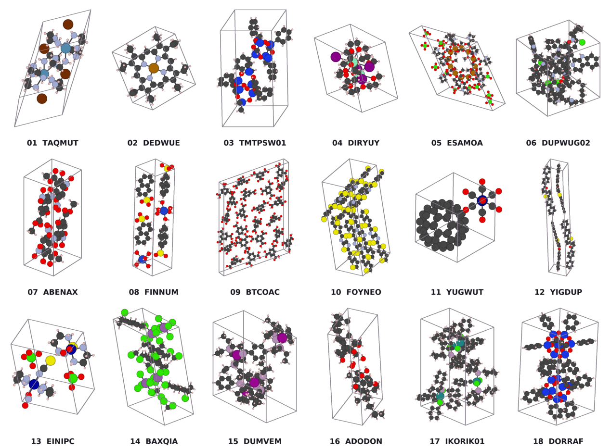

# Packora

[](https://arxiv.org/abs/2608.26962)
[](https://huggingface.co/nayoung10/Packora-ckpt)
[](https://nayoung10.github.io/packora/)
[](https://posing-knives-desired-cadillac.trycloudflare.com)

<p align="center">
  
</p>

Packora is a family of generative models for molecular crystal structure prediction. This repository provides a simple API for generating crystal structures with pretrained models. It also includes the data preparation, training, benchmark prediction, and evaluation code needed to reproduce our work, which requires a licensed CCDC CSD installation.

## Contents

- [Installation](#installation)
  - [Requirements](#requirements)
  - [Environment setup](#environment-setup)
- [Data preparation](#data-preparation)
  - [Build the published splits](#build-the-published-splits)
  - [Custom CSD preprocessing](#custom-csd-preprocessing)
- [Benchmark training](#benchmark-training)
  - [Packora-M](#packora-m)
  - [Packora-L](#packora-l)
- [Ablations](#ablations)
  - [Model architecture](#model-architecture)
  - [Training](#training-1)
  - [Conditioning](#conditioning)
  - [Inference](#inference)
  - [Scaling](#scaling)
- [Prediction](#prediction)
  - [Benchmark prediction](#benchmark-prediction)
  - [Benchmark evaluation](#benchmark-evaluation)
  - [Using the prediction API](#using-the-prediction-api)
- [Acknowledgments](#acknowledgments)
- [License](#license)
- [Citation](#citation)

## Installation

### Requirements

The current code uses the CSD Python API to featurize arbitrary molecular
inputs, construct the training datasets, and evaluate packing similarity. The
API is distributed by CCDC and is not available from public PyPI. Model training
and prediction from already prepared inputs do not otherwise require database
access.

### Environment setup

Clone the public repository and create a fresh environment:

```bash
git clone https://github.com/nayoung10/packora.git
cd packora

uv venv --python 3.10.12
source .venv/bin/activate
```

Install the tested PyTorch stack and Packora dependencies:

```bash
uv pip install --torch-backend cu130 \
  torch==2.10.0 torchvision==0.25.0 torchaudio==2.10.0 \
  xformers==0.0.35
uv pip install -r requirements-torch210.txt
uv pip install -e .
```

Install the CSD Python API from the package supplied with your licensed CSD
distribution, then verify that it can access the database:

```bash
python -c "from ccdc.io import EntryReader; print(EntryReader('CSD'))"
```

### Quick reproduction check

After installation, with CUDA and a licensed CSD installation available:

```bash
python scripts/smoke_release.py
```

This downloads Packora-M and the published manifests/statistics, reconstructs a
few CSD entries, runs one training and fine-tuning batch, generates candidates
with 32 sampling steps, and evaluates one benchmark target. It checks the
workflow, not the paper's numerical results. Downloads include approximately
1.1 GB of weights; runtime depends on the network and GPU. The check reuses the
installed dependency stack and creates a disposable editable installation.
Temporary downloads, datasets, environments, and predictions are cleaned up
on success or failure. Add `--report /path/to/report.json` to retain a report.

## Data preparation

Packora was trained on structures from the Cambridge Structural Database. CSD
records cannot be redistributed with this repository, so the
[Packora data repository](https://huggingface.co/datasets/nayoung10/Packora-data)
provides CSV refcode manifests, the released dataset statistics, and
reconstruction instructions for licensed CSD users. It does not distribute raw
CSD structures or prebuilt LMDB datasets.

Two splits are used in the paper:

| Dataset | Paper usage | Hydra configuration |
| --- | --- | --- |
| [CLARI split](https://huggingface.co/the-matter-lab/clari) | Main benchmark training and evaluation | `data=csd_clari`; stage 2 uses `data=csd_clari_finetune` |
| Packora ablation split (`csd`) | Controlled studies in Section 5 | `data=csd` |

The released manifests use one row per CSD entry and the common columns
`id,split`. Benchmark manifests add an optional semicolon-separated
`truth_refcodes` column for polymorph-aware evaluation and may provide an
authoritative `flexibility` label. In the code and artifact names, `csd` refers
to the ablation dataset previously described as `csd_ablations`.

Use one data root for manifests and every generated dataset. Public configs
read `PACKORA_DATA_ROOT` (default: `./data`) and `PACKORA_LOG_ROOT`
(default: `./logs`):

```bash
export PACKORA_DATA_ROOT=/path/to/packora-data
```

Download the manifests and statistics to the data root:

```bash
uv pip install huggingface_hub
hf download nayoung10/Packora-data --repo-type dataset --local-dir "$PACKORA_DATA_ROOT"
```

After downloading the dataset repository, the initial layout is:

```text
$PACKORA_DATA_ROOT/
├── csv_manifests/
│   ├── csd.csv
│   ├── csd_clari.csv
│   ├── ccdc_teaching.csv
│   ├── csp_blind5.csv
│   ├── csp_blind6.csv
│   ├── csp_blind7.csv
│   ├── flexible.csv
│   └── rigid.csv
├── csd/
│   └── dataset_stats.json
└── csd_clari/
    └── dataset_stats.json
```

For example:

```csv
id,split
AABHTZ,train
AACANI10,train
```

### Build the published splits

The primary reproduction workflow converts any `id,split` CSV manifest into
model-ready LMDB splits. It retrieves each entry through the licensed CSD
Python API and applies the training-time coordinate, bond, stereochemistry,
molecule-membership, and RDKit-template representation.

Run the public builder with:

```bash
python scripts/convert_csv_to_dataset.py \
  --manifest "$PACKORA_DATA_ROOT/csv_manifests/csd.csv" \
  --output-dir "$PACKORA_DATA_ROOT/csd"

python scripts/convert_csv_to_dataset.py \
  --manifest "$PACKORA_DATA_ROOT/csv_manifests/csd_clari.csv" \
  --output-dir "$PACKORA_DATA_ROOT/csd_clari"
```

Benchmark datasets use the same converter and share the `csd_benchmarks`
output directory because each manifest has a distinct split name:

```bash
for benchmark in \
  ccdc_teaching csp_blind5 csp_blind6 csp_blind7 flexible rigid; do
  python scripts/convert_csv_to_dataset.py \
    --manifest "$PACKORA_DATA_ROOT/csv_manifests/${benchmark}.csv" \
    --output-dir "$PACKORA_DATA_ROOT/csd_benchmarks"
done
```

The first value in `truth_refcodes` is the CSD entry converted into model input;
the complete group is stored with that material and propagated into prediction
artifacts for evaluation. The rigid and flexible manifests are separate 50-entry
datasets; together they form the historical OXtal collection.

Every distinct safe value in the `split` column becomes a matching LMDB and
aligned atom-count and CSD-family caches. Standard names produce
`train.lmdb`, `val.lmdb`, and `test.lmdb`, while custom names such as `banana`
and `apple` produce `banana.lmdb` and `apple.lmdb`. Split names containing path
separators or traversal components are rejected.

Entries first use CCDC missing-hydrogen addition. If that conversion fails or
exceeds the default 180-second whole-entry timeout, the builder retries with
only hydrogen sites deposited in the CSD record. RDKit template generation is
attempted independently in both passes; an RDKit embedding failure is nonfatal
and stores unavailable template conditioning. If explicit-hydrogen recovery
times out, the builder retries that entry with RDKit disabled; this keeps
conformer stalls from discarding an otherwise valid structure. Entries that
still fail are omitted without aborting the remaining build and are recorded in
`failed_refcodes.csv`.

The builder retains resumable SQLite caches under `_preprocess_cache/` and
writes `dataset_manifest.json`, `verification.json`, and `failed_refcodes.csv`.
Each split produces `<split>.lmdb/`, `<split>.num_atoms.npy`, and
`<split>.csd_families.npy`. Existing final split artifacts are protected; pass
`--overwrite` to replace them. Exact model-facing reconstruction requires the
same CSD release and compatible CCDC and RDKit versions.

The data repository includes the released statistics consumed by
`StandardizingScaler`. To reproduce or regenerate them after converting the two
training datasets, run:

```bash
python scripts/extract_dataset_stats.py \
  --data_dir "$PACKORA_DATA_ROOT" \
  --dataset_name csd

python scripts/extract_dataset_stats.py \
  --data_dir "$PACKORA_DATA_ROOT" \
  --dataset_name csd_clari
```

By default, statistics use the first 10,000 training entries, matching the
released training setup. Set `--limit 0` only when intentionally recomputing
them from every entry. The final generated layout is:

```text
$PACKORA_DATA_ROOT/
├── csv_manifests/...
├── csd/
│   ├── train.lmdb/
│   ├── train.num_atoms.npy
│   ├── train.csd_families.npy
│   ├── val.lmdb/
│   ├── val.num_atoms.npy
│   ├── val.csd_families.npy
│   ├── dataset_stats.json
│   ├── failed_refcodes.csv
│   ├── dataset_manifest.json
│   ├── verification.json
│   └── _preprocess_cache/
├── csd_clari/              # same train/val outputs; no test split
└── csd_benchmarks/
    ├── ccdc_teaching.{lmdb,num_atoms.npy,csd_families.npy}
    ├── csp_blind5.{lmdb,num_atoms.npy,csd_families.npy}
    ├── csp_blind6.{lmdb,num_atoms.npy,csd_families.npy}
    ├── csp_blind7.{lmdb,num_atoms.npy,csd_families.npy}
    ├── flexible.{lmdb,num_atoms.npy,csd_families.npy}
    └── rigid.{lmdb,num_atoms.npy,csd_families.npy}
```

For benchmarks, the `.num_atoms.npy` and `.csd_families.npy` files are
converter-generated verification and batching caches, not requirements for
ordinary prediction or evaluation. Retain the atom counts for filtering or
bucketed batching and the family cache only for family-aware sampling.

### Custom CSD preprocessing

As an optional advanced workflow, users may construct, filter, and split their
own CSD dataset with the existing preprocessing scripts:

```bash
python scripts/preprocess.py \
  output_dir=/path/to/data/csd \
  split=all

python scripts/split_csd_lmdb.py \
  --input-lmdb /path/to/data/csd/all.lmdb \
  --output-dir /path/to/data/csd
```

The corresponding preprocessing configuration is
`configs/preprocess/csd.yaml`.
Benchmark exclusion uses the downloaded public manifests, including the published
teaching targets rather than the full CCDC teaching catalog.

## Benchmark training

The experiments reported in the paper used eight H200 GPUs, but this is not a strict hardware requirement.

The reported benchmark training runs used `torch.compile` with the Inductor
backend.

The public model names map to the following architecture configurations:

| Model | Architecture configuration | Single width | Pair width | Heads | Parameters |
| --- | --- | ---: | ---: | ---: | ---: |
| Packora-M | `model/arch=small` | 512 | 128 | 8 | 88M |
| Packora-L | `model/arch=base` | 768 | 192 | 12 | 187M |

Benchmark training uses two stages:

1. `src/train.py` trains on unit cells containing at most 300 atoms.
2. `src/finetune.py` starts a fresh optimization stage from a stage-1
   checkpoint and extends training to 512 atoms.

The commands below omit settings that are already defaults: eight-device DDP,
effective batch size 128, the Pairmixer, and post-Pairmixer noisy-input entry.
W&B run names are also omitted because they do not affect training.
The original jobs were open-ended; the explicit limits below stop after the
epochs represented by the checkpoints selected for the benchmark models.

### Packora-M

Stage 1:

```bash
python src/train.py \
  data=csd_clari \
  ++trainer.num_sanity_val_steps=0 \
  trainer.max_epochs=250
```

Stage 2:

```bash
python src/finetune.py \
  data=csd_clari_finetune \
  init_ckpt_path=/path/to/stage-1.ckpt \
  trainer.max_epochs=160
```

### Packora-L

Stage 1:

```bash
python src/train.py \
  data=csd_clari \
  ++trainer.num_sanity_val_steps=0 \
  model/arch=base \
  model.optimizer.weight_decay=1e-2 \
  trainer.max_epochs=400
```

Stage 2:

```bash
python src/finetune.py \
  data=csd_clari_finetune \
  init_ckpt_path=/path/to/stage-1.ckpt \
  trainer.max_epochs=120
```

`src/finetune.py` reconstructs the model configuration from the source run,
loads the selected weights, and starts fresh optimizer, scheduler, and training
state. Set `run_config_path=/path/to/source-run/.hydra/config.yaml` when the
checkpoint has been moved away from its run directory.

The released checkpoints also retain full Lightning state for continuing the
published stage-2 run. Keep the downloaded `.hydra/config.yaml` and
`checkpoints/` layout together, set a total epoch limit greater than the epoch
stored in the checkpoint, and use `ckpt_path` rather than `init_ckpt_path`:

```bash
export PACKORA_DATA_ROOT=/path/to/packora-data

python src/finetune.py \
  data=csd_clari_finetune \
  ckpt_path=/path/to/Packora-ckpt/packora-m/checkpoints/packora-m.ckpt \
  paths.data_dir="$PACKORA_DATA_ROOT" \
  trainer.max_epochs=<new-total-epoch-limit>
```

This restores the model, EMA, optimizer, scheduler, loop, epoch, and global-step
state. New checkpoints are written under the new Hydra run directory.

## Ablations

We provide the Hydra overrides for each design choice explored in Section 5 of the paper.

### Model architecture

The architecture study compares DiT with pair-bias attention, pre- and
post-entry Pairmixer variants, and a Pairformer-like variant. `TriMul` denotes
triangle multiplicative updates, `TriAtt` triangle attention, `SU` a
single-track update, and `GEM` the geometric enhancement module.

| Config | Entry | TriMul | TriAtt | SU | GEM | Relevant Hydra override |
| --- | --- | :---: | :---: | :---: | :---: | --- |
| A | — | — | — | — | — | `~model/pairmixer` |
| B | — | — | — | — | Yes | `~model/pairmixer`<br>`model/embedder/geometry_pair=gem` |
| C | Pre | Yes | — | — | — | `model.net.noisy_input_entry=before_pairmixer` |
| D | Pre | Yes | — | Yes | — | `model.net.noisy_input_entry=before_pairmixer`<br>`model.net.pairmixer.update_single=true` |
| E | Pre | Yes | — | — | Yes | `model.net.noisy_input_entry=before_pairmixer`<br>`model/embedder/geometry_pair=gem` |
| F | Post | Yes | — | — | — | Default architecture |
| G | Post | Yes | — | Yes | — | `model.net.pairmixer.update_single=true` |
| H | Post | Yes | — | — | Yes | `model/embedder/geometry_pair=gem` |
| I | Post | Yes | Yes | Yes | — | `model.net.pairmixer.update_single=true`<br>`model.net.pairmixer.use_triangle_attention=true` |

*Configuration I (Pairformer)* uses triangle attention implemented with
[DeepSpeed4Science's `DS4Sci_EvoformerAttention`](https://github.com/deepspeedai/DeepSpeed/blob/master/deepspeed/ops/deepspeed4science/evoformer_attn.py).
If you want to run this, install its optional build dependencies:

```bash
uv pip install deepspeed ninja nvidia-cutlass
```

Verify the kernel import:

```bash
python -c "from deepspeed.ops.deepspeed4science import DS4Sci_EvoformerAttention; print(DS4Sci_EvoformerAttention)"
```

### Training

| Study | Values compared | Relevant Hydra override |
| --- | --- | --- |
| Time sampler | Uniform, Beta, Beta–uniform mixture, logit-normal | `model/time_sampler={uniform,beta,uniform_beta,logit_normal}` |
| Crystal augmentation | Without or with random fractional translation | `data.crystal_translate={false,true}` |
| Endpoint objective | L1 or L2 | `model.loss_type={l1,l2}` |
| Coordinate-to-lattice loss weighting | 1:1, 5:1, 10:1, 20:1, 50:1 | `model.loss_weights.coords={1,5,10,20,50}` |
| Auxiliary pair loss | None, L1, or smooth-LDDT | `model/loss/periodic_pair_distance={none,l1,smooth_lddt}` |
| Optimizer | Muon or AdamW | `model/optimizer={muon,adamw}` |
| EMA | Raw weights, decay 0.999, or decay 0.9999 | `model.ema_decay={0.999,0.9999}`<br>`eval_with_ema={false,true}` |

### Conditioning

The conditioning study varies template-coordinate dropout during training and
evaluates each model under different combinations of stereochemistry,
template, and space-group conditioning.

| Study | Values compared | Relevant Hydra override |
| --- | --- | --- |
| Template dropout | 0, 0.5, 1.0 | `conditioning.policy.dropout_probs.template={0.0,0.5,1.0}` |

### Inference

| Study | Values compared | Relevant Hydra override |
| --- | --- | --- |
| Solver | Flow ODE Euler, flow SDE Euler–Maruyama, EDM–Heun | `sampling.method={ode,sde,heun}`|
| Sampling budget | 10–1000 nominal function evaluations | `sampling.num_steps=<steps>` |
| EDM discretization | $\rho \in \{1,3,5,6,7,8,9,10\}$ | `++sampling.sampler_args.rho={1,3,5,6,7,8,9,10}` |
| Template augmentation | None, rotation only, rotation + translation | `data.template_rotate={false,true}`<br>`data.template_translate={false,true}` |
| Autoguidance | Disabled or weights 1.0, 1.5, 2.0, 2.5 | `sampling.autoguidance.enabled=true`<br>`sampling.autoguidance.bad_ckpt_path=/path/to/bad.ckpt`<br>`sampling.autoguidance.weight={1.0,1.5,2.0,2.5}` |

Euler methods make one denoiser call per step. Heun makes approximately two, so
its step count is half the matched nominal function-evaluation budget.

### Scaling

The scaling study varies the single-track width $d_s$, pair-track width $d_p$,
and corresponding attention-head count while keeping the remaining recipe
fixed. The number of heads is scaled with $d_s$ so that the dimension per head
remains $d_s / h = 64$.

| ID | Single width | Pair width | Heads | Relevant Hydra override |
| --- | ---: | ---: | ---: | --- |
| W0 (Packora-M) | 512 | 128 | 8 | `model/arch=small` |
| W1 | 512 | 192 | 8 | `arch.dim_pair=192` |
| W2 | 512 | 256 | 8 | `arch.dim_pair=256` |
| W3 | 768 | 128 | 12 | `arch.dim_single=768`<br>`arch.dim_pair=128`<br>`arch.heads=12` |
| W4 (Packora-L width) | 768 | 192 | 12 | `model/arch=base` |
| W5 | 1024 | 128 | 16 | `arch.dim_single=1024`<br>`arch.dim_pair=128`<br>`arch.heads=16` |

## Prediction

Packora provides separate paths for single-input inference and prepared
benchmark generation. Pretrained Packora-M and Packora-L checkpoints are
available from the
[Packora model repository](https://huggingface.co/nayoung10/Packora-ckpt).

```bash
export PACKORA_MODEL_ROOT=/path/to/Packora-ckpt
hf download nayoung10/Packora-ckpt --local-dir "$PACKORA_MODEL_ROOT"
```

Keep each model's `.hydra/config.yaml` beside its `checkpoints/` directory.

### Using the prediction API

The offline API in `src/prediction/api/` predicts one crystal candidate per
call. It requires a CUDA GPU and the licensed CSD Python API
for training-equivalent SMILES featurization. Models are loaded lazily and
cached when a predictor is reused.

```python
from pathlib import Path

from src.prediction.api import PackoraPredictor


model_root = Path("/path/to/Packora-ckpt")
request = {
    "model": "packora-m",
    "components": [{"smiles": "N#Cc1ccc(cc1)C#N", "ratio": 1}],
    "z": 1,
}

predictor = PackoraPredictor(
    model_manifest_path=model_root / "model_manifest.json",
    z_prior_path=model_root / "z_distribution.json",
)
result = predictor.predict(request, seed=42)

print(result.cart_coords)
print(result.frac_coords)
print(result.cell)
print(result.summary)
paths = result.write("predictions", stem="tepnit_seed_42")
print(paths.cif, paths.json)
```

`result.cart_coords` contains the exported Cartesian coordinates after
centering and a final whole-molecule wrap, so every molecule's mass-weighted
fractional center lies inside the unit cell. `result.frac_coords` contains the
corresponding fractional coordinates. The result also provides CIF and MOL2
text plus a writer for matching `.cif` and provenance `.json` files. Existing
outputs are not overwritten unless `overwrite=True` is passed.

For the call above, `"predictions"` is the output directory and
`"tepnit_seed_42"` is the filename stem. The writer creates a flat pair of
files:

```text
predictions/
├── tepnit_seed_42.cif   # Crystal structure for crystallographic software
└── tepnit_seed_42.json  # Request, seed, provenance, arrays, bonds, and summary
```

The JSON record contains the submitted request, sampling seed, model and
checkpoint identifiers, resolved `Z`, Cartesian and fractional coordinates,
cell, atomic identities, molecule membership, bonds, MOL2 text, and runtime
summary. It does not replace the CIF; it preserves the machine-readable inputs
and outputs needed for reproducibility and downstream processing. Use a unique
stem for each candidate, for example `tepnit_seed_43`, or pass `overwrite=True`
intentionally when replacing an existing pair.

The same request can be run from a JSON file:

```bash
python -m src.prediction.api request.json \
  --model-manifest /path/to/Packora-ckpt/model_manifest.json \
  --z-prior /path/to/Packora-ckpt/z_distribution.json \
  --output-dir predictions \
  --stem tepnit_seed_42 \
  --seed 42
```

`model` must be `packora-m` or `packora-l`; each component must contain a
connected molecular SMILES and a positive integer ratio.

<details>
<summary><strong>Omitting Z</strong></summary>

<br>

`z` is optional. When it is omitted, the API samples `Z` from the configured
empirical CSD prior using the prediction seed:

```python
request = {
    "model": "packora-m",
    "components": [{"smiles": "N#Cc1ccc(cc1)C#N", "ratio": 1}],
}

result = predictor.predict(request, seed=42)

print(result.summary["z"])
print(result.summary["z_source"])  # empirical_prior
print(result.summary["z_prior"])
```

The draw is deterministic for the same request, prior, and seed. Before
sampling, the API removes `Z` values that would expand the input beyond the
configured atom limit (512 by default), then renormalizes the remaining
probabilities. `result.summary["z"]` is the sampled value,
`result.summary["z_source"]` is `"empirical_prior"`, and
`result.summary["z_prior"]` records the conditioned probability, original
probability, excluded probability mass, and SHA-256 digest of the prior file.
An explicit `z` bypasses the prior and produces `z_source="explicit"` and
`z_prior=None`.

The prior JSON must provide aligned positive values and nonnegative
probabilities that sum to one:

```json
{
  "categorical": {
    "values": [1, 2, 4, 8],
    "probabilities": [0.05, 0.15, 0.75, 0.05]
  }
}
```

Checkpoint paths resolve in this order: the `checkpoint_paths` constructor
argument or CLI `--checkpoint`, `PACKORA_M_CHECKPOINT` or
`PACKORA_L_CHECKPOINT`, then the selected model path in an optional model
manifest. Direct checkpoint paths do not require a manifest. To configure both
released models from one file instead, pass `model_manifest_path`, CLI
`--model-manifest`, or `PACKORA_MODEL_MANIFEST`; repository-relative checkpoint
entries are resolved from the directory containing that manifest.
Configure an omitted-`z` prior with `z_prior_path`, CLI `--z-prior`, or
`PACKORA_Z_PRIOR`. A missing prior is only an error when `z` is omitted.

</details>

### Benchmark prediction

By default, prediction uses EMA weights, template and stereochemistry
conditioning, no space-group conditioning, and EDM–Heun with 200 steps.
These settings can be changed in [`configs/predict.yaml`](configs/predict.yaml)
or overridden from the command line.

```bash
python src/predict.py \
  ckpt_path=/path/to/checkpoint.ckpt \
  source.benchmark=<benchmark_name> \
  sampling.samples_per_datapoint=<num_candidates> \
  trainer=gpu \
  trainer.devices=<num_devices> \
  paths.output_dir=/path/to/predictions/
```

The available benchmark sources are:

| `source.benchmark` | Dataset |
| --- | --- |
| `rigid` | OXtal rigid targets |
| `flexible` | OXtal flexible targets |
| `csp_blind5` | Fifth CCDC CSP Blind Test |
| `csp_blind6` | Sixth CCDC CSP Blind Test |
| `csp_blind7` | Seventh CCDC CSP Blind Test |
| `ccdc_teaching` | CCDC teaching subset |

The published OXtal targets are provided as the separate `rigid` and `flexible`
manifest splits.

### Benchmark evaluation

`src/evaluate.py` evaluates a completed prediction directory with the CSD
packing-similarity workflow. The default and `clari` protocols use the same
underlying metrics, but only `clari` bootstraps the results:

```bash
python src/evaluate.py \
  --predictions-dir /path/to/predictions \
  --protocol clari
```

## Acknowledgments

We acknowledge OpenAI's Codex and GPT models—GPT-5.4, GPT-5.5, GPT-5.6 Sol,
and GPT-6 Astra—for assistance with software development.

We thank the Cambridge Crystallographic Data Centre (CCDC) for maintaining the
Cambridge Structural Database and granting permission for this release.
Packora has been published with permission from the CCDC.

## License

Packora source code is licensed under [PolyForm Noncommercial 1.0.0](LICENSE).
Model weights are licensed under
[CC BY-NC 4.0](https://creativecommons.org/licenses/by-nc/4.0/).
Third-party code retains its original terms; see [THIRD_PARTY_NOTICES.md](THIRD_PARTY_NOTICES.md).

Only CSD refcodes and split assignments are distributed as manifests, without
CSD structures or preprocessed datasets. Licensed users reconstruct datasets locally.

The CSD and CSD Python API are governed separately by CCDC licensing terms and
are not distributed with Packora.

## Citation

If you use Packora, please cite the accompanying paper.

```bibtex
@misc{kim2026packorasystematicdesigngenerative,
  title         = {Packora: Systematic Design for Generative Molecular Crystal Structure Prediction},
  author        = {Nayoung Kim and Kiyoung Seong and Sungsoo Ahn},
  year          = {2026},
  eprint        = {2608.26962},
  archivePrefix = {arXiv},
  primaryClass  = {cs.LG},
  url           = {https://arxiv.org/abs/2608.26962}
}
```
